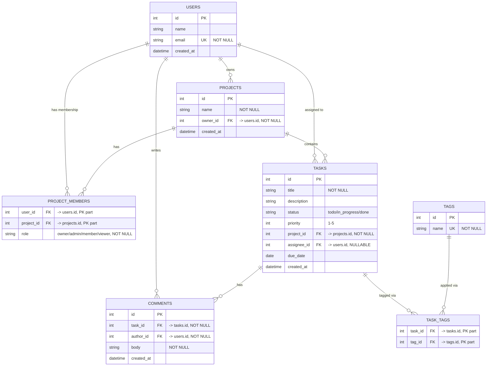

# Task Management Platform — System Design

## 1. Overview and Requirements

Task Management is a multi-tenant project and task tracker. A user can own or join
projects, create and assign tasks within those projects, tag tasks for categorization,
and discuss tasks through comments. Access to a project's data is governed by the
member's role on that project (owner / admin / member / viewer).

**Functional requirements**

- FR1: A user can create, view, update, and delete tasks in any project they belong to
  (subject to their role), including assigning a task to another member of the same project.
- FR2: A user can attach and remove tags on a task, and browse tasks by tag or status.
- FR3: A user can comment on a task; only the comment's author can edit or delete it
  (project owners/admins may also remove a comment for moderation).

**Non-functional requirements**

- NFR1: Task list endpoints (`GET /projects/:id/tasks`) return within 200ms at p95 for
  projects with up to 10,000 tasks.
- NFR2: Read endpoints maintain 99.9% availability; a single database failover must not
  take writes down for more than 30 seconds.
- NFR3: No API response ever includes `password_hash`, and every write or role-restricted
  read is authorized against the caller's `project_members` role before it executes.

## 2. Entity-Relationship Diagram

Notes on cardinality: `project_members` and `task_tags` are pure join tables with
composite primary keys (`user_id, project_id` and `task_id, tag_id` respectively) — no surrogate `id`. `tasks.assignee_id` is nullable: a task can exist with zero assignees, which the `USERS ||--o{ TASKS` relation captures (a user is assigned to zero or many tasks).

## 3. Architecture

**Layers**

| Layer                | Responsibility                                                                                                                                                                            |
| -------------------- | ----------------------------------------------------------------------------------------------------------------------------------------------------------------------------------------- |
| Client (Next.js)     | Renders UI, sends the JWT access token as `Authorization: Bearer`, never holds business logic.                                                                                            |
| Controller (NestJS)  | Parses the route/DTO, runs `AuthGuard` (valid JWT) and `RolesGuard` (project role check), delegates to a service. Contains no queries.                                                    |
| Service              | Business rules: existence checks, cross-entity validation (e.g. "assignee must be a project member"), orchestrates one or more repository calls, wraps multi-row writes in a transaction. |
| Repository (TypeORM) | Executes queries/mutations against Postgres, returns entities. No authorization logic here.                                                                                               |
| Database (Postgres)  | Source of truth; enforces FK integrity and the composite PKs on join tables.                                                                                                              |

**Trace: `POST /api/v1/projects/:id/tasks` ("create a task")**

1. **Client** sends `POST /api/v1/projects/42/tasks` with a JSON body
   `{ title, description?, priority, assigneeId?, dueDate?, tagIds? }` and a bearer token.
2. **Controller**: `AuthGuard` verifies the JWT signature/expiry → if invalid/missing, **401**.
   `RolesGuard` loads `project\_members` for `(user\_id, project\_id=42)`; if no row exists → **404**
   (the project's existence is not revealed to non-members); if the row's role is `viewer` → **403**.
   The DTO is validated (`class-validator`); a malformed body → **400** before the service runs.
3. **Service** (`TaskService.create`) confirms the project row exists (defense in depth,
   also **404** if somehow missing), and if `assigneeId` is present, confirms that user has a
   `project\_members` row for the same project — **400** if not (a data problem, not an authz
   problem, since the caller is already authorized). The DTO is mapped to a `Task` entity
   with `status = 'todo'` as the default.
4. **Repository**: within a transaction, `TaskRepository.save(task)` inserts into `tasks`,
   then if `tagIds` were supplied, bulk-inserts rows into `task\_tags`. The transaction
   guarantees a task is never left with a partial tag set.
5. **Response**: the saved entity (with resolved tags) is mapped to the response DTO and
   returned as **201** with a `Location` header pointing at `/api/v1/tasks/:id`.
