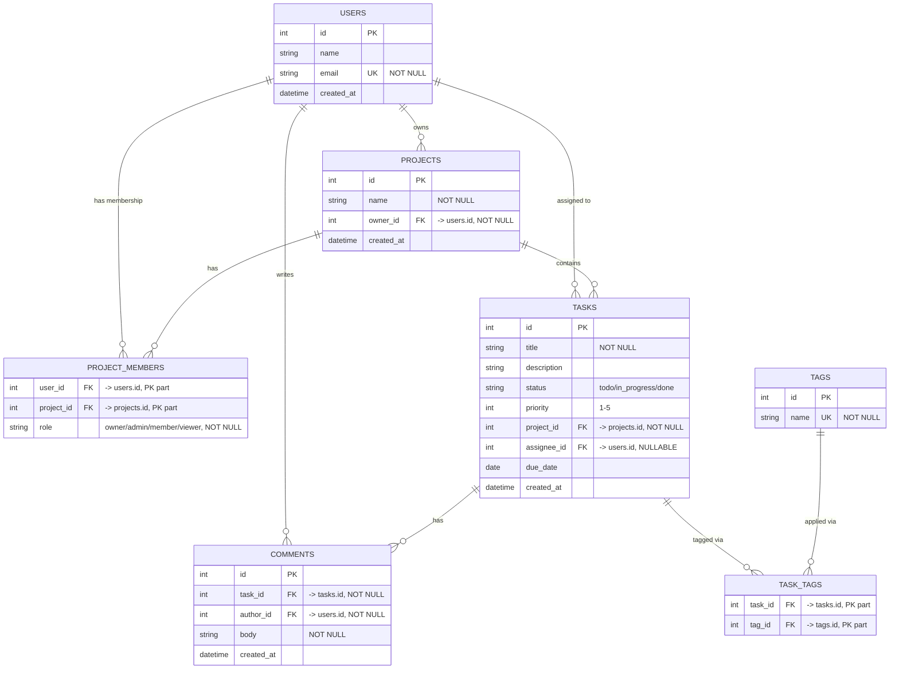

# Task Management Platform — System Design

## 1. Overview and Requirements

Task Management is a multi-tenant project and task tracker. A user can own or join
projects, create and assign tasks within those projects, tag tasks for categorization,
and discuss tasks through comments. Access to a project's data is governed by the
member's role on that project (owner / admin / member / viewer).

**Functional requirements**

- FR1: A user can create, view, update, and delete tasks in any project they belong to
  (subject to their role), including assigning a task to another member of the same project.
- FR2: A user can attach and remove tags on a task, and browse tasks by tag or status.
- FR3: A user can comment on a task; only the comment's author can edit or delete it
  (project owners/admins may also remove a comment for moderation).

**Non-functional requirements**

- NFR1: Task list endpoints (`GET /projects/:id/tasks`) return within 200ms at p95 for
  projects with up to 10,000 tasks.
- NFR2: Read endpoints maintain 99.9% availability; a single database failover must not
  take writes down for more than 30 seconds.
- NFR3: No API response ever includes `password_hash`, and every write or role-restricted
  read is authorized against the caller's `project_members` role before it executes.

## 2. Entity-Relationship Diagram

Notes on cardinality: `project_members` and `task_tags` are pure join tables with
composite primary keys (`user_id, project_id` and `task_id, tag_id` respectively) — no surrogate `id`. `tasks.assignee_id` is nullable: a task can exist with zero assignees, which the `USERS ||--o{ TASKS` relation captures (a user is assigned to zero or many tasks).

## 3. Architecture

**Layers**

| Layer                | Responsibility                                                                                                                                                                            |
| -------------------- | ----------------------------------------------------------------------------------------------------------------------------------------------------------------------------------------- |
| Client (Next.js)     | Renders UI, sends the JWT access token as `Authorization: Bearer`, never holds business logic.                                                                                            |
| Controller (NestJS)  | Parses the route/DTO, runs `AuthGuard` (valid JWT) and `RolesGuard` (project role check), delegates to a service. Contains no queries.                                                    |
| Service              | Business rules: existence checks, cross-entity validation (e.g. "assignee must be a project member"), orchestrates one or more repository calls, wraps multi-row writes in a transaction. |
| Repository (TypeORM) | Executes queries/mutations against Postgres, returns entities. No authorization logic here.                                                                                               |
| Database (Postgres)  | Source of truth; enforces FK integrity and the composite PKs on join tables.                                                                                                              |

**Trace: `POST /api/v1/projects/:id/tasks` ("create a task")**

1. **Client** sends `POST /api/v1/projects/42/tasks` with a JSON body
   `{ title, description?, priority, assigneeId?, dueDate?, tagIds? }` and a bearer token.
2. **Controller**: `AuthGuard` verifies the JWT signature/expiry → if invalid/missing, **401**.
   `RolesGuard` loads `project\_members` for `(user\_id, project\_id=42)`; if no row exists → **404**
   (the project's existence is not revealed to non-members); if the row's role is `viewer` → **403**.
   The DTO is validated (`class-validator`); a malformed body → **400** before the service runs.
3. **Service** (`TaskService.create`) confirms the project row exists (defense in depth,
   also **404** if somehow missing), and if `assigneeId` is present, confirms that user has a
   `project\_members` row for the same project — **400** if not (a data problem, not an authz
   problem, since the caller is already authorized). The DTO is mapped to a `Task` entity
   with `status = 'todo'` as the default.
4. **Repository**: within a transaction, `TaskRepository.save(task)` inserts into `tasks`,
   then if `tagIds` were supplied, bulk-inserts rows into `task\_tags`. The transaction
   guarantees a task is never left with a partial tag set.
5. **Response**: the saved entity (with resolved tags) is mapped to the response DTO and
   returned as **201** with a `Location` header pointing at `/api/v1/tasks/:id`.

## 4. Non-Functional Plan

**Caching.** The one read worth caching is `GET /projects/:id/tasks` (the paged task
list for a project) — it is requested on every board load and is comparatively
expensive (join + filter + sort). It is cached by key
`tasks:list:{projectId}:{page}:{pageSize}:{status}:{sort}` with a 30-second TTL. It is
invalidated immediately (not just left to expire) on any `POST/PATCH/DELETE` to
`/projects/:id/tasks` or `/tasks/:id` for that project, since a task's status or
assignment changing is exactly what a board view needs to reflect promptly. Accepted
cost: for up to 30 seconds after a write from a _different_ browser tab/user, a viewer
may see a stale list — acceptable because this is a task board, not a payments ledger.
`GET /tasks/:id` for a single task is **not** cached, because the immediate-read-after-
write case (a user opens the task they just edited) must always be correct.

**Scaling (reads vs writes).** Writes (`POST/PATCH/DELETE`) go to the primary. Reads
are split: list/browse endpoints (`GET /projects/:id/tasks`, `GET /tags`, etc.) may be
served from a read replica to keep primary load down as project/task counts grow.
Accepted cost: replication lag, typically sub-second, means a replica read can be
briefly behind the primary — the same class of staleness as the cache above. One read
must **not** go to a replica: `GET /tasks/:id` immediately following that same user's
own create/update of that task (read-your-writes) — the API layer routes a read to the
primary whenever it is serving the same request/session that just wrote the row, so a
user is never shown a "missing" task they just created.

**Consistency.** The system accepts eventual consistency for list views (bounded by the
30s cache TTL and typical sub-second replication lag) in exchange for not putting every
read on the primary. It requires strong (primary-read) consistency for: the response
body of a write itself, and any immediate re-fetch by the same actor of what they just
wrote. This also bounds the N+1 problem at the API edge: `GET /projects/:id/tasks`
loads each task's tags via a single batched query (`tag\_id IN (...)` joined through
`task\_tags`) rather than one query per task, so the list endpoint's cost stays roughly
constant per page regardless of how many tags a task has.

## 5. Trade-offs

| #   | Decision                                                                                                           | Rejected option                                         | Criterion                                                                                                                                                                                                                                                                                                                                                                                                 |
| --- | ------------------------------------------------------------------------------------------------------------------ | ------------------------------------------------------- | --------------------------------------------------------------------------------------------------------------------------------------------------------------------------------------------------------------------------------------------------------------------------------------------------------------------------------------------------------------------------------------------------------- |
| T1  | Enforce `project\_members` role checks in a shared `RolesGuard`, applied per-route with a `@Roles()` decorator.    | Check the caller's role inside every service method.    | Per-service checks let a single loaded entity answer ownership questions the guard can't (e.g. "is this the comment author"), but this domain has 20+ routes across 5 resources sharing the _same_ 4-role check — a missed check in one service is invisible until reported, while a route with no `@Roles()` decorator is visibly unprotected in code review.                                            |
| T2  | Cache the project task-list read, invalidated on write, rather than adding a read replica for that specific query. | Add a read replica and route all task-list reads there. | A replica helps every read query uniformly but costs an entire second database and ongoing replication ops; a cache costs one Redis key per (project, page, filter) and directly targets the one query (`GET /projects/:id/tasks`) that is actually hot, per NFR1.                                                                                                                                        |
| T3  | Offset pagination (`page`/`pageSize`) for all list endpoints.                                                      | Cursor pagination (`?cursor=`).                         | Cursor pagination is the right choice when result sets are unbounded and clients only ever page forward (e.g. a global activity feed), but a project's task list is bounded (thousands, not millions, of rows) and the UI needs to jump to an arbitrary page number — something cursor pagination cannot do. Offset's known weakness (row-shift on concurrent insert) is judged acceptable at this scale. |
