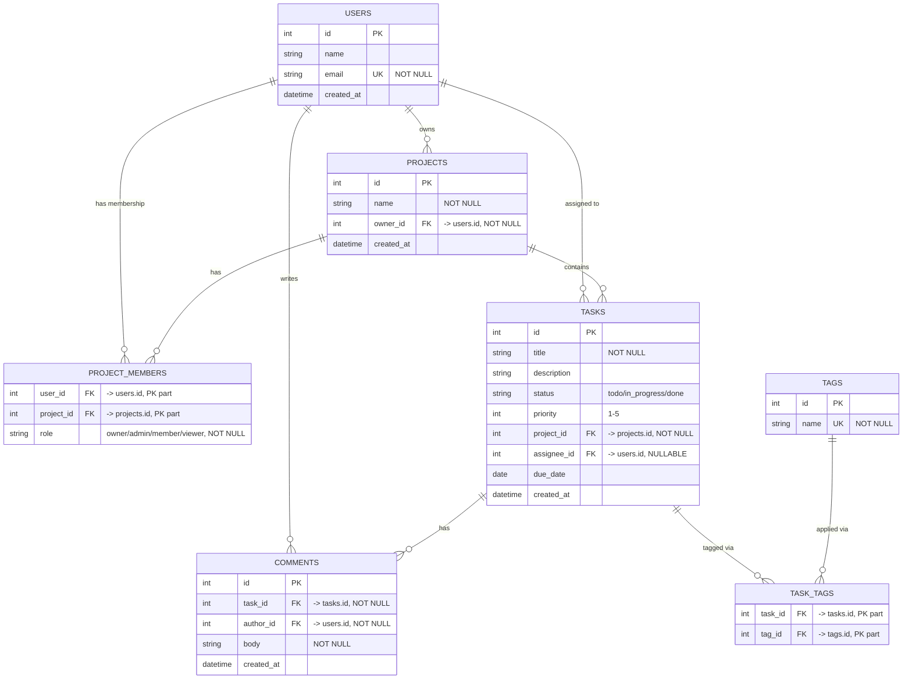

# Task Management Platform — System Design

## 1. Overview and Requirements

Task Management is a multi-tenant project and task tracker. A user can own or join
projects, create and assign tasks within those projects, tag tasks for categorization,
and discuss tasks through comments. Access to a project's data is governed by the
member's role on that project (owner / admin / member / viewer).

**Functional requirements**
- FR1: A user can create, view, update, and delete tasks in any project they belong to
  (subject to their role), including assigning a task to another member of the same project.
- FR2: A user can attach and remove tags on a task, and browse tasks by tag or status.
- FR3: A user can comment on a task; only the comment's author can edit or delete it
  (project owners/admins may also remove a comment for moderation).

**Non-functional requirements**
- NFR1: Task list endpoints (`GET /projects/:id/tasks`) return within 200ms at p95 for
  projects with up to 10,000 tasks.
- NFR2: Read endpoints maintain 99.9% availability; a single database failover must not
  take writes down for more than 30 seconds.
- NFR3: No API response ever includes `password_hash`, and every write or role-restricted
  read is authorized against the caller's `project_members` role before it executes.

## 2. Entity-Relationship Diagram

Notes on cardinality: `project_members` and `task_tags` are pure join tables with
composite primary keys (`user_id, project_id` and `task_id, tag_id` respectively) — no surrogate `id`. `tasks.assignee_id` is nullable: a task can exist with zero assignees, which the `USERS ||--o{ TASKS` relation captures (a user is assigned to zero or many tasks).
